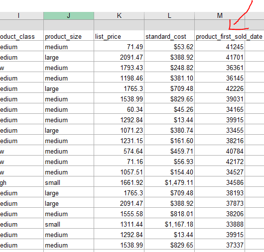
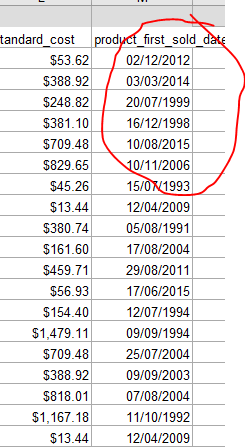
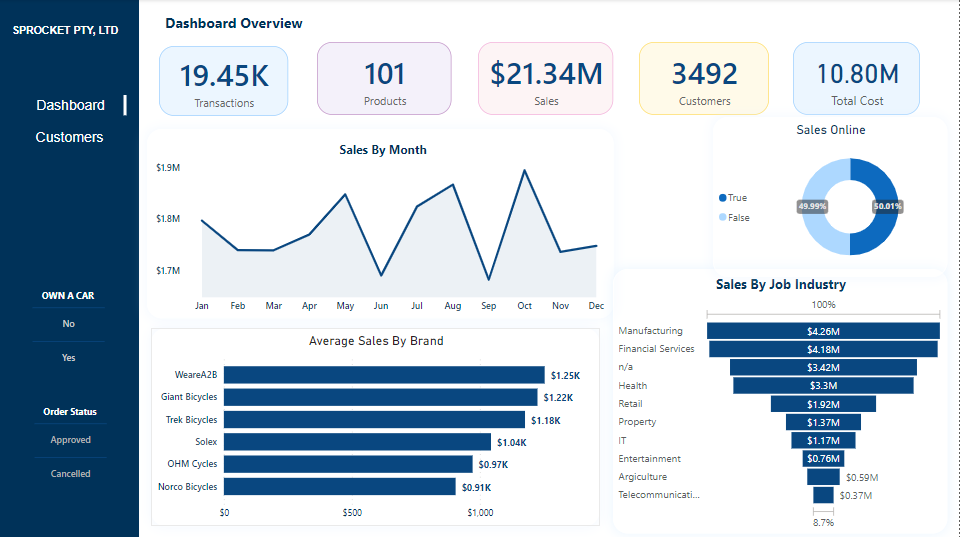
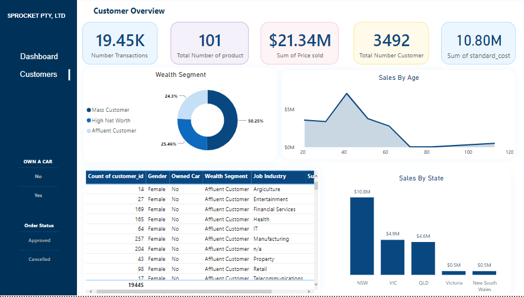

# ANALYSIS OF SPROCKET Central Pty Ltd. 

    

---
## Project Overview 
This project was completed as part of the KPMG virtual internship, the dataset used was provided by KPMG. This dataset was in excel format with 4 different worksheets, 
Transaction sheet, Customer Demographic sheet, Customer address sheet and New customer sheet. 

**Aim:** Identify which of the 1000 customer Sprocket Central Pty Ltd target based on this data set. 
## Scope of work
This project will be in three phases 

1. **Data Quality:**  In this phase of project, the data set is checked to identify and understand the impact of each field of data on the sales profit. 
The Customer demographic, Transaction and customer address is looked into, the following defect are identified. 
- Various columns such as Job Title, and brand of purchase, have empty values in certain records: These records have been removed from the dataset. 
- Inconsistent value for the same attribute (Such as Female being represented as “F”, “Femal” and “Female”): Regular expression was used to replace them 
- Inconsistent datatype for the same attribute: Numeric value for some fields and string for others, reference; the date field). 
2. **Data analytics approach**
This approach is based on a deep understanding of the customers, operations, and industry trends. By leveraging Tools such as Excel and Power BI, I am able to extract valuable insight from the large volume of data I collect and use that information to make data-driven decisions and improve overall performance.

**Variable Identification and Bi variant Analysis are used in this phase**
- **_Types of Variables:_**  Predictor Variable (Customer ID, Age, Job Industry.
                               Target Variable (Order Status, Brand)
- **_Data Type:_**     Character Type (Product Class, Product Size, Gender.)
                        Numeric Type (Customer ID, Date)
- **_Variable Category:_** Categorical Type (Brand, Class, Gender)	Continuous Type (Transaction ID, Job Title)
  
**BI- Variant Analysis:**  This phase of the project was done to find Relationships between two variables 

3.	**Data Modeling:** This phase add some deduced Parameters to the dataset 
-	The transaction date is formatted to Month for proper analysis and visualization 
-	The DOB is formatted into Age and Age Bracket for easy data trend analysis
-	The Gender with the value “U” is replaced based on the _mean distribution_ of the gender. Removing this field will decrease the dataset.

  Old date 		                    |	      New date
:------------------------------:  | :------------------------------:
                 |   

## Power BI Dasboard 
The Power BI Customer Analysis Dashboard developed to analyze and visualize customer data. This dashboard provides valuable insights into customer behavior, purchasing patterns, and trends, enabling informed decision-making and targeted strategies to enhance customer satisfaction and business growth.

